# Data Server 

This document will breifly explain the architecture of Data Server and how we intend to perform Video-On-Demand with Nimble Streamer.

## Idea Expression

To explain where this document describe, we need to understand the overall concept. On the circle in the diagram Fig.1 there is a server side s1 in area of explanation, in which is going to be explained in this document. 

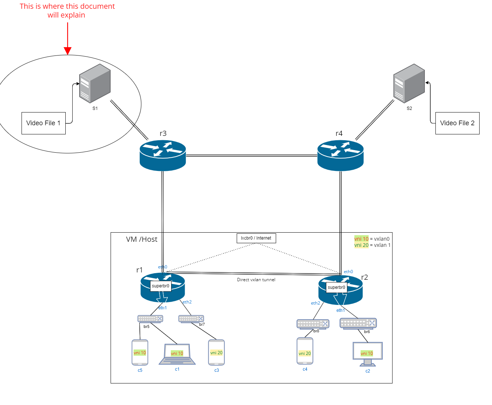 <br />
Fig.1 Diagram defines area of explanation.

Inside the area of explanation, the simple diagram in Fig.2 shows the architecture and Nimble Server tool, which we use to implement Video-On-Demand in this project. 

※ In this document we test directly with End User C1, which is host machine, in real implementation this node will change to router. 

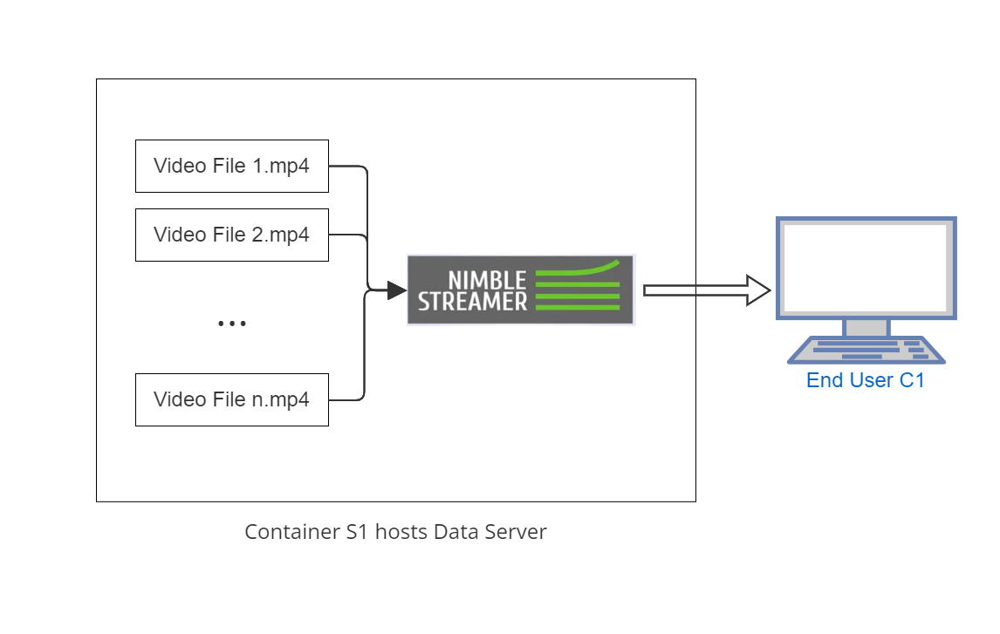 <br />
Fig.2 Diagram of architecture inside S1.


### Remarks:

※ 1. Now we are currently using Nimble Server on https://wmspanel.com/ to stream video, we expect to stream video using LOCAL Nimble Server. (work-in-progress)
※ 2. Currently we verify the content using browser on the host machine, but we expect to verify it using tool on container. (work-in-progress)


## Table of Contents

1. [Setup and Installation](#1-setup-and-installation)
2. [Configuration](#2-configuration)
3. [Streaming](#3-streaming)
4. [References](#4-references)
<hr/>

### 1. Setup and Installation

1.  login to container which you wish to host server. In this case, it is s1.

2.  run command (For Ubuntu 18.04 Bionic Beaver., for other Ubuntu version, please see https://wmspanel.com/nimble/install#os_ubuntu)

```bash
bash -c 'echo -e "deb http://nimblestreamer.com/ubuntu bionic/">> /etc/apt/sources.list'
```
3.  Install wget and gnupg package for retrieving file using HTTP(S), FTP(S) and then update. 

```bash
apt-get update
apt-get install -y wget
apt-get install -y gnupg
```

4.  Run the following command to retrieve nimble gpg public key file.

```bash
wget -q -O - http://nimblestreamer.com/gpg.key | sudo apt-key add -
```

When it succeeded, the word "OK" will appear as in Fig.3 .

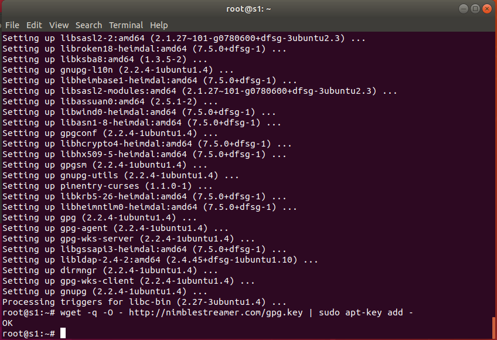 <br />
Fig.3 Get nimble-streamer package via wget
 
5.  Now, we can run the install command and update the package.

```bash
apt-get update && apt-get install -y nimble
```

6.  Register server in WMSPanel, which is a tool for Nimble Streamer management. Also fill in credentials. After finished , there will be a message as shown in Fig.4.
※ If you do not own account on WMSPanel, sign up for free at https://wmspanel.com/account/sign_upm, then use credentials (email and password ) in this step.

```bash
/usr/bin/nimble_regutil -u [email] -p [password]
```

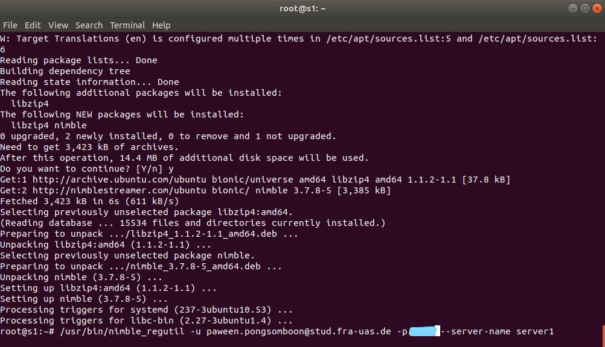 <br />
Fig.4 Register Server on WMSPanel.

7.  (Optional) You can change the [display name] for Nimble instance in WMSPanel via --server-name option. After that you can check the effect on https://wmspanel.com/server.
```bash
/usr/bin/nimble_regutil --server-name [display name]
```

8.  Check your server at https://wmspanel.com/server as shown in Fig. 5


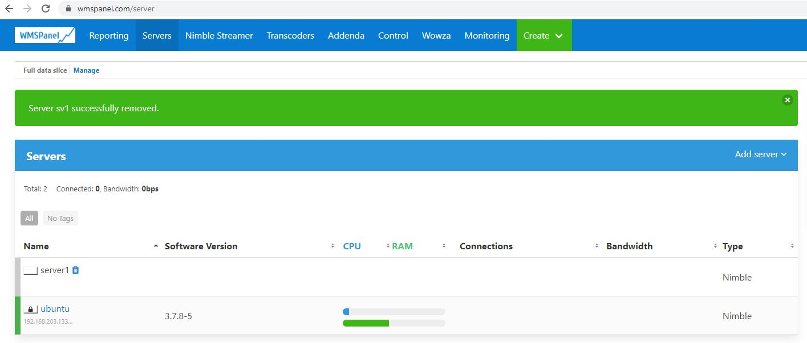 <br />
Fig.5 Servers on WMSPanel. 


※ You can always restart the nimble server by using command
```bash
service nimble restart
```
<hr/>

### 2. Configuration

1.  Prepare video file in designated directory. In this case, we create a new directory at /usr/vod to host video files (In this case we have "test_video.mp4" as shown in Fig. 6).

※ Note that when creating directory, do not forget to assign -p to add path. For example mkdir -p /usr/vod/

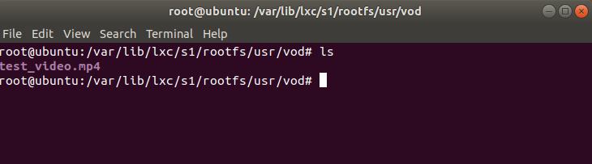 <br />
Fig. 6 Display test video file in directory

2. Go to WMSPanel (https://wmspanel.com/) and select "Nimble Streamer/VOD and re-streaming routes" (Fig. 7). Click "Add VOD streaming route" (Fig. 8).

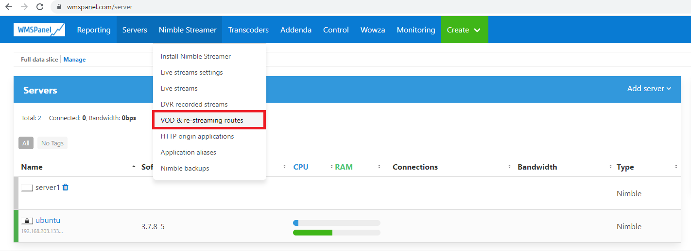 <br />
Fig. 7 Set streaming route

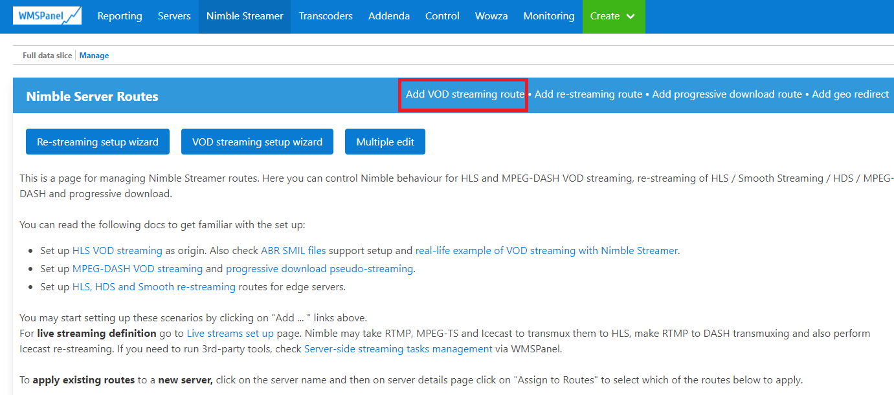 <br />
Fig. 8 Add streaming route

3.  There will be pop up window. Fill in the following information as shown.<br />
1.) Path you wish to be appear on url, in this case, we use `/vod/` <br />
2.) Path of your video on container. In this case it is the path to /vod/ in container S1.
`/var/lib/lxc/s1/rootfs/usr/vod/` 
Then click "OK"

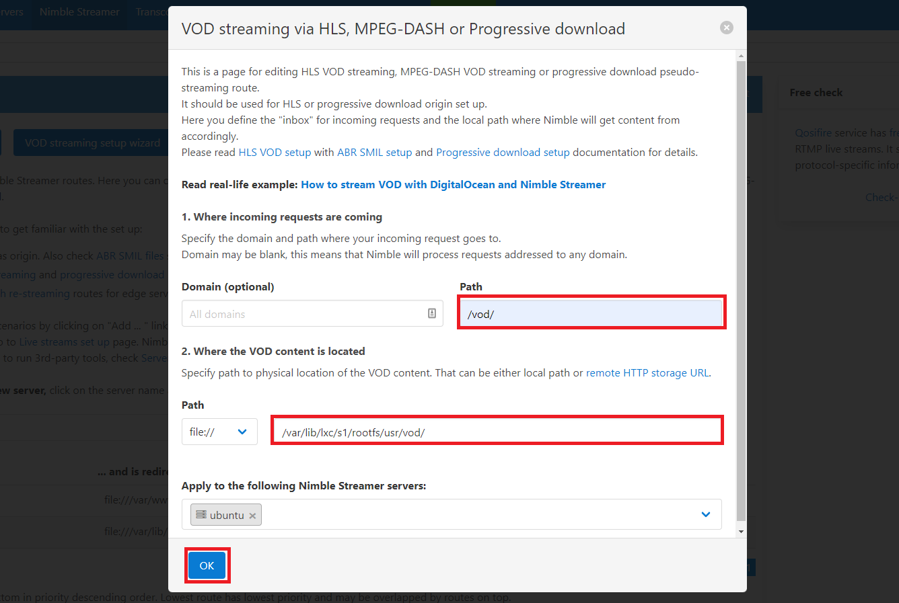 <br />
Fig. 9 Config streaming video file path

4.  Now, you can find the Stream url to your video by click "?" at the end of server in the list (Fig. 10). <br />
For example, in this case the Strean url is "http://192.168.203.133:8081/vod/sample.mp4/playlist.m3u8." (Fig. 11).

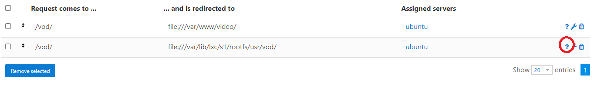 <br />
Fig. 10 

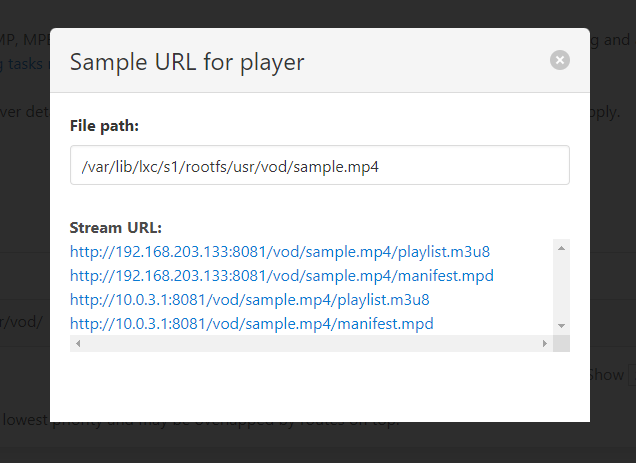 <br />
Fig. 11 Stream-Url

<hr/>

### 3. Streaming

1.  Edit the url according to video file by replacing "sample.mp4/playlist.m3u8." with video filename, in this case it is "test_video.mp4". 

2.  Use a browser in the host machine to view the video file. <br />
 ※ This is a solution for the moment, we expect to use a tool in each container to verify content (Fig.12).

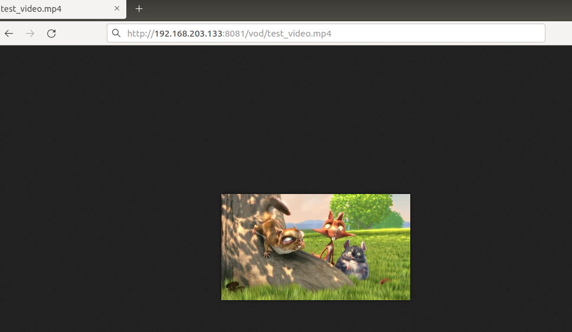 <br />
Fig. 12 Test Stream using Firefox on host machine.

<hr/>

### 4. References

1.  https://wmspanel.com/nimble
2.  https://www.youtube.com/watch?v=HzEpItuOQAE
3.  https://blog.wmspanel.com/2013/11/streaming-vod-digitalocean-nimble-streamer.html


